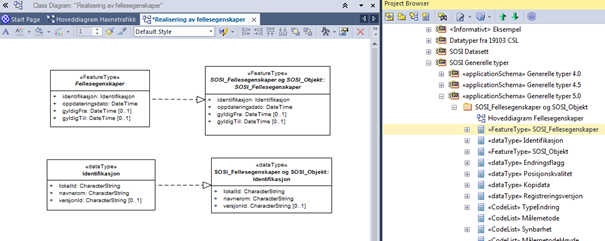

[discrete]
== Trinn 16 Dokumenter i et diagram realiseringen av fellesegenskaper fra SOSI_Fellesegenskaper og SOSI_Objekt.

//Trinn 16 versjon 2024-09-11

En kan som vist i punkt 15 legge inn realiseringer til klasser i SOSI del 1 i et realiseringsdiagram og vise hvilke fellesegenskaper som er realisert.

