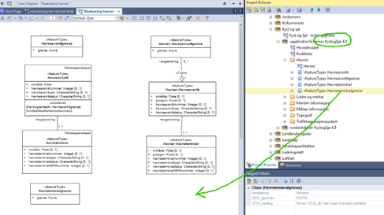
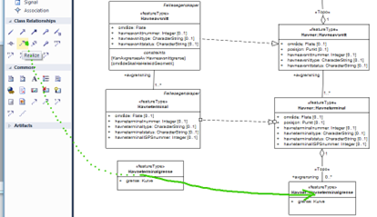

[discrete]
== Trinn 15 Dokumenter i diagram hvor objekttypene er realisert fra, hva som er tatt med og hva som er nytt.

//Trinn 15 versjon 2024-09-11

Lag gjerne et eget eller flere klassediagram for dette, og gi det et navn slik som Realisering objekttyper eller Realisering havner.
Dra alle produktets objekttyper og datatyper inn som linker i diagrammet for realisering. 
Finn den opprinnelige fagområdestandarden i prosjektbrowseren. dra så de objekttypene fra fagområdepakkene de er realisert ifra i SOSI del 2 inn rett over sin tilsvarende klasse.

Legg inn realiseringsforhold fra standard EA verktøkasse. Dette vil dokumentere hvilket subsett som er tatt med, og hvilke innstramminger og tillegg som er utført slik at fagområdestandardene kan forbedres ved neste revisjon.

