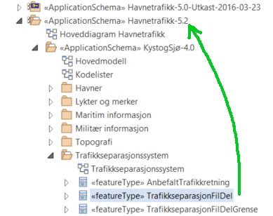

[discrete]
== Trinn 7 Flytt ønskede objekttyper, datatyper og kodelister opp i den nye applikasjonsskjemapakka.	

//Trinn 7 versjon 2024-09-09

Dra og slipp alle aktuelle klasser eller underpakker du trenger fra kopien av sin opprinnelige fagområdepakke direkte inn i applikasjonsskjemapakka. 

Det resterende innholdet i kopiene av fagområdepakkene skal til slutt slettes, slik at en står igjen med kun modellelementer som er relevante for produktet. Lagre gjerne først de resterende elementene i en egen pakke lokalt, i tilfelle det viser seg at en må ha med flere modellelementer.
