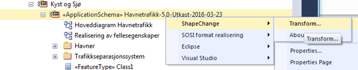
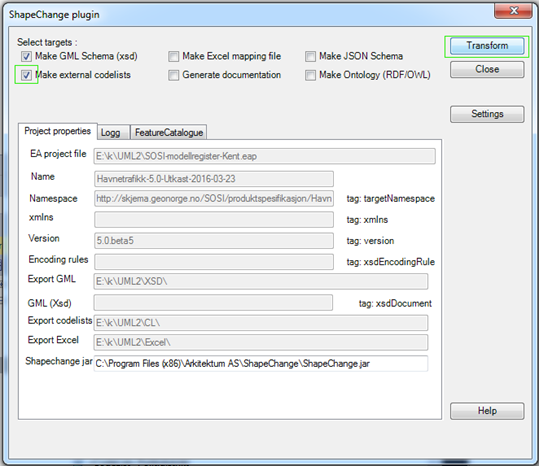

[discrete]
== Trinn 26 Generer GML-applikasjonsskjema med ShapeChange via plugginn i Enterprise Architect.	

//Trinn 26 versjon 2024-09-12

Kjøring av ShapeChange mot den fulle fila SOSI_modellregister_JET40.eap vil kunne ta flere timer fordi ShapeChange leser gjennom alle pakkene i prosjektfila selv om de ikke er valgt. Det er kun ShapeChange som har dette problemet, de andre verktøyene bør alle kjøres direkte mot pakker i modellregisteret.
Før GML-skjemaet genereres, anbefales det derfor innstendig å kopiere hele applikasjonsskjemapakka til ei ny, tom EA-prosjektfil. Hensikten med det er å redusere tiden ShapeChange bruker for å generere GML-skjema. Samtidig vil eventuelle feilmeldinger under genereringsprosessen kun gjelde den valgte applikasjonsskjemapakka vi er interessert i og ikke eventuelle andre pakker som befinner seg i samme EA-prosjekt. Merk at dersom samiske tegn forekommer i elementnavn så må en eap-startfil være oppdatert for å kunne handtere dette, se beskrivelsen under første punkt i sosi.geonorge.no/SVNFAQ. For å kopiere pakka skal du høyreklikke på applikasjonsskjemapakka, velg Copy/Paste – Copy to Clipboard – Full Structure for Duplication, åpne så et nytt EA-prosjekt (File  New Project). I det nye prosjektet høyreklikker du i på Model i Project Browser og velger (Copy/Paste -) Paste Package from Clipboard.
Generer GML-applikasjonsskjema ved å høyreklikke på applikasjonsskjemapakka og velge: Extensions/ShapeChange/Transform... 

Sørg for å hake av for generering av eksterne kodelister dersom slike finnes i modellen. Kontroller at pakkeinformasjonen er korrekt og trykk på Transform.

Feilmeldinger vil bli dokumentert i verktøydokumentasjonen under generering. 
Etter generering kan loggen gjennomgåes for å finne evt. gjenværende feil i modellen. 
Loggen etter generering ligger i log.xml og log.html, og disse kan finnes på samme katalogen som der modellfila ligger. GML-applikasjonsskjemafila legges vanligvis på en underkatalog \XSD\INPUT og eksterne kodelister som gml:Dictionary legges på en annen underkatalog \CL\INPUT.

Kodelistefiler kan også genereres enkeltvis ved å velge en enkelt kodeliste og kjøre Script/listSKOSfraKodeliste og Script/listGMLDICTfraKodeliste. Genererte filer vil da lages på samme sted som .eap-fila ligger.

