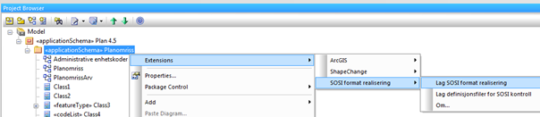
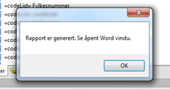

[discrete]
== Trinn 24 Generer SOSI-formatbeskrivelse og legg denne inn i produktspesifikasjonsdokumentet.

//Trinn 24 versjon 2024-09-12

For modeller etter versjon 5.0 kan man høyreklikke på applikasjonsskjemapakka og velge "Generate Documentation": Velg Template: SOSI-formatbeskrivelse og Format: RTF-format, og angi filnavn for resultat, trykk så Generate.  TBD
For modeller etter versjon 4.x kan man høyreklikke på applikasjonsskjemapakka og velge Extensions/SOSI/SOSI-formatrealisering.

Etter en tid vil det komme opp melding om at et dokument er produsert.

Merk og kopier alt innhold i det produserte dokumentet, og lim det inn i produktspesifikasjonsdokumentet under kapittel 11 eller i et eget vedlegg for SOSI-formatrealisering. Se etter felter som inneholder FIX og om alt ellers er komplett.
