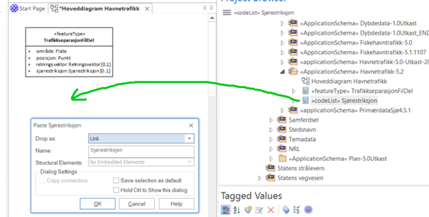

[discrete]
== Trinn 8 Dra alle klassene ut i et klassediagram kalt Hoveddiagram Nnn, +
eventuelt i egne diagram for kodelister og datatyper.

//Trinn 8 versjon 2024-09-09

Vis alle objekttypene ved å dra disse inn i valgte diagrammer, som "Simpel Link".

Plasser objekttypene i diagrammene slik at det blir lett å få oversikt over helheten i modellen.

Gjenta samme prosess for alle aktuelle datatyper og kodelister.

