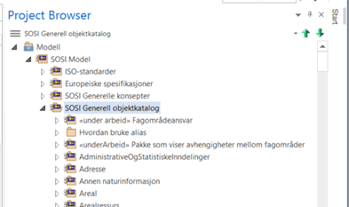

= Merk, og lag kopier av hver relevant fagområdepakke til din egen applikasjonsskjemapakke

Versjon 2024-09-04

Merk og kopier med Full Structure for Duplication, og lim inn kopiene. Alle lenker mellom modellelementene i pakka blir da beholdt. Det er spesielt viktig å lage kopier av disse pakkene da modellelementene i disse kopiene får tildelt nye interne id-er i EA. Derved unngår man å forveksle id-er i egen produktspesifikasjonspakke med eksisterende fagområde-id-er.

Lim inn kopien i applikasjonsskjemapakka.

Repeter å lage egne kopier for alle pakker med aktuelt innhold.

<<<

