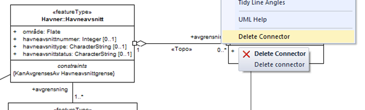
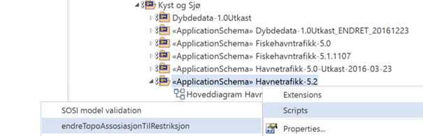
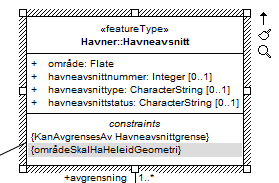
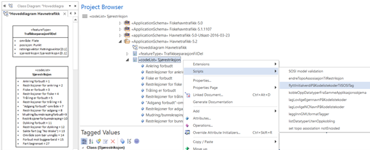
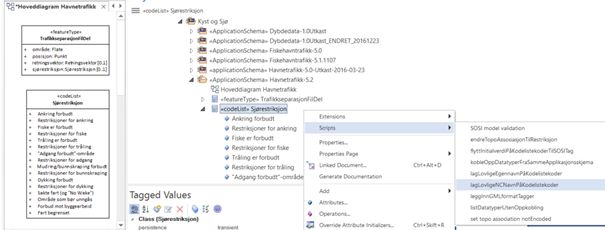
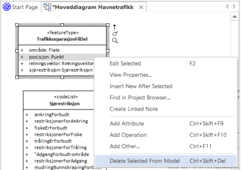

[discrete]
== Trinn 9 Fjern «topo»-assosiasjoner og lag tilsvarende restriksjoner. +
Lag lovlige navn på koder. +
Fjern unødvendige assosiasjonsroller, egenskaper og koder fra de valgte klassene.

//Trinn 9 versjon 2024-09-09

De spesielle nasjonale assosiasjonene merket med stereotypen «topo» er ikke videreført i SOSI 5.0. Disse skal derfor fjernes og tilsvarende informasjon overføres til restriksjoner. Dette gjøres enten manuelt ved å skrive inn restriksjonen og så høyreklikke på assosiasjonen og velge "Delete connector"

Dette kan gjøres helautomatisk ved å høyreklikke på applikasjonsskjemapakka og velge Scripts/endreTopoAssosiasjonTilRestriksjon og trykke Ok.

Dersom en ønsker å beskrive ytterligere begrensninger i bruk av modellen angis da dette som en eller flere restriksjoner med selvforklarende navn, og beskrevet i både klart språk og i Object constraint language (OCL). 

Mange kodelister hadde tidligere meningsløse tallkoder som initialverdi. Disse initialverdiene kan nå flyttes til en tagged value "SOSI_verdi". Dette gjøres helautomatisk ved å høyreklikke på ei kodeliste i prosjektbrowseren, og velge Scripts/flyttInitialverdiPåKodelistekoderTilSOSITag og trykke Ok.

Dersom kodene er vanlige typenavn kan en lage NCName helautomatisk ved å høyreklikke på ei kodeliste, og velge Scripts/lagLovligeNCNavnPåKodelistekoder og trykke Ok.
De gamle navnene flyttes til en tagged value "SOSI_presentasjonsnavn". 

Endrede koder må alltid verifiseres etter automatisk endring. Dersom kodene er egennavn eller forkortelser bør de endres manuelt.

Egenskaper og roller som er opsjonelle ([0..1] og [0..*]) i fagområdet og er unødvendige i produktet kan fjernes fra klassene. Koder som ikke er relevante i produktet kan også fjernes. Velg klassen og så dens egenskaper, eller velg egenskapen direkte (velg kassen, og så klikk på egenskapen i diagrammet, høyreklikk og velg "Delete Selected From Model"):

Velg "Delete" på alle de unødvendige og opsjonelle egenskapene etter tur.

