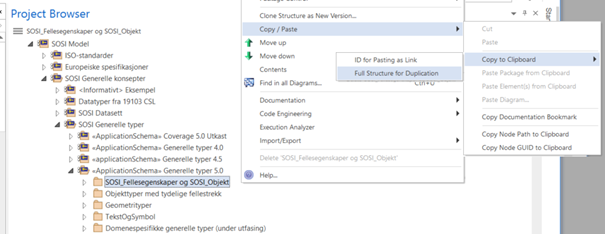
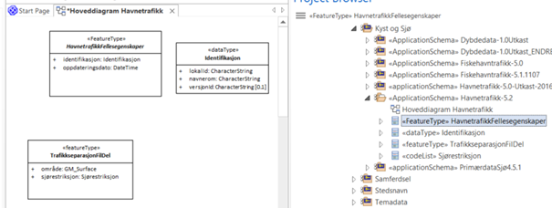

[discrete]
== Trinn 11 Lag supertype(r) som subsett av SOSI_Fellesegenskaper eller SOSI_Objekt, og ta med påkrevde og ønskede fellesegenskaper.

//Trinn 11 versjon 2024-09-11

Lagre en kopi av pakka SOSI_Fellesegenskaper i SOSI Generelle typer 5.0 i klippebordet og lim kopien inn i din applikasjonsskjemapakke på samme måte som tidligere nevnt i punkt 7.

Flytt alle aktuelle klasser, datatyper og kodelister fra kopien av pakka SOSI-Fellesegenskaper opp til egen applikasjonsskjemapakke.
Lag så en eller flere kopier av objekttypene SOSI_Fellesegenskaper og SOSI_Objekt med nye forståelige navn i applikasjonsskjemapakka. (Eks. Fellesegenskaper og FellesegenskaperKurver.) 

Det aller enkleste er å ta med kun klassen SOSI_Fellesegenskaper og datatypen Identifikasjon. Dette sikrer at en oppfyller viktige krav i geodataloven. Hvis det er behov for flere fellesegenskaper kan SOSI_Objekt og andre klasser kopieres inn, og en utelater alle uønskede fellesegenskaper fra disse på samme måte som i punkt 9, og strammer inn opsjonaliteten på samme måte som i punkt 10. 
