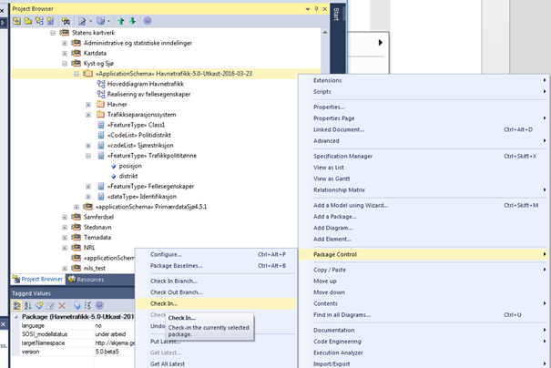
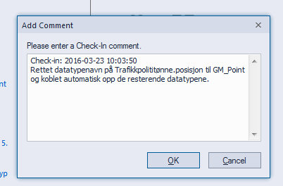
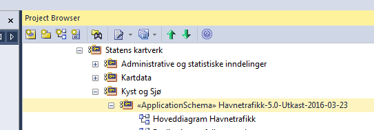

[discrete]
== Trinn 18 Lagre den nye ferdige applikasjonsskjemapakka til SOSI modellregister under hoveddelen som heter SOSI Produktspesifikasjoner.

//Trinn 18 versjon 2024-09-11

Det forutsettes her at du enten har fulgt konfigurasjonsanvisning i kapittel 5 slik at pakka allerede har blitt lagt til i SOSI modellregisteret på SVN-serveren, eller at du kan gjøre dette nå.
Er arbeidet med UML-modellen (foreløpig) avsluttet husk å sende den oppdaterte modellen til serveren ved å sjekke inn pakka. Dersom du ønsker å vise klart og tydelig at pakka er uferdig kan pakkenavnet midlertidig endres med et forklarende tillegg som likner på "Havnetrafikk-5.0Utkast2016-03-23".

Høyreklikk på applikasjonsskjemapakka, velg så Package Control og Check In. Se eksempel nedenfor.

Husk å alltid skrive en kort og forståelig kommentar om hvilke endringene som er gjort inn i "Add Comment"-dialogboksen.

Har applikasjonsskjemapakka blitt sjekket inn riktig vil det være nøkkelsymbol   foran pakkenavnet.

Husk også å sjekke inn din etats/ditt institutts pakke på samme måten i tilfellet du har sjekket den ut tidligere.

