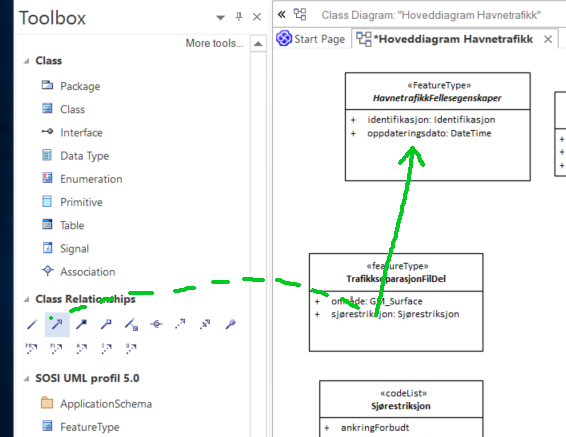
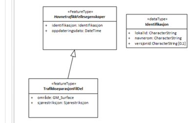

[discrete]
== Trinn 12 Legg inn at alle objekttyper arver definerte fellesegenskaper.	

//Trinn 12 versjon 2024-09-11

Velg verktøy for generalisering og trykk musepekeren ned på subtypen, dra over supertypen og slipp.

Korrekt angivelse av arv fra Fellesegenskaper skal da se slik ut:

