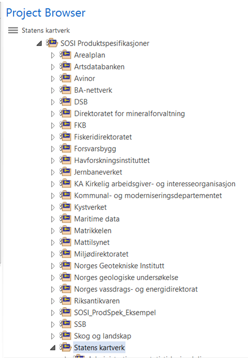
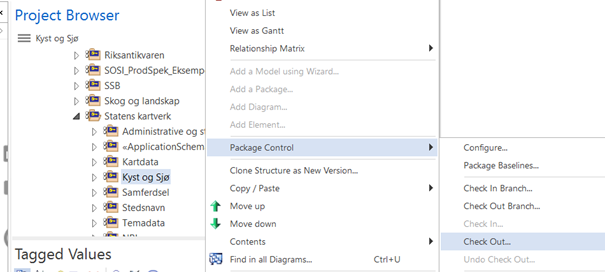
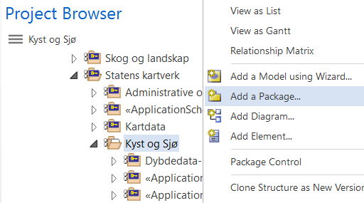
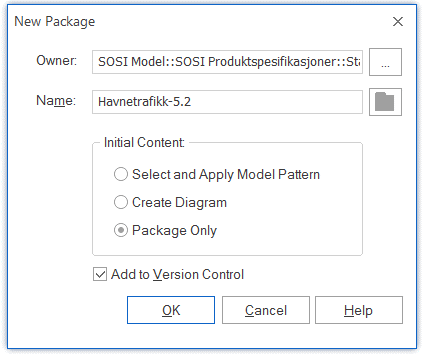
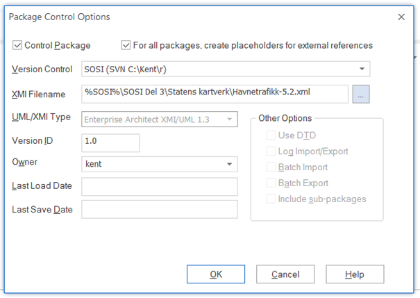
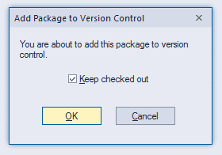
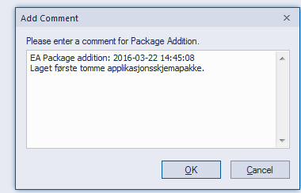
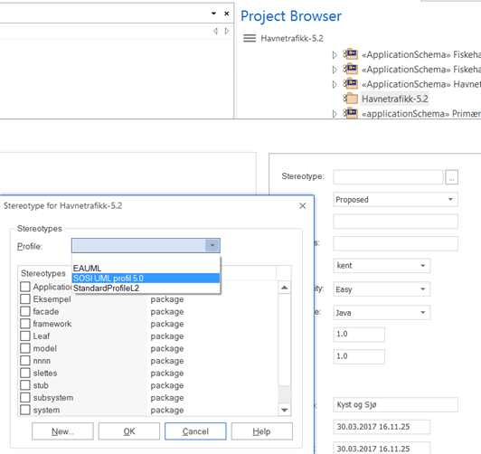
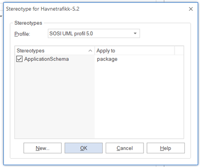
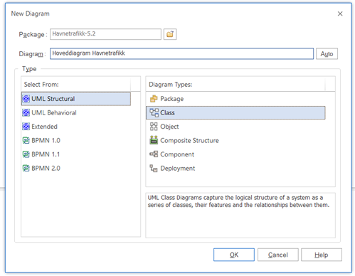

[discrete]
== Steg 5 Lag en ny pakke for produktspesifikasjonen stereotypet «ApplicationSchema» i SOSI-modellregister for å lagre produktspesifikasjonsmodellen

//Steg 5 versjon 2024-09-09

UML-modeller for produktspesifikasjoner skal lagres under mappen "SOSI Produktspesifikasjoner" og der igjen under de respektive partenes mapper. +
Se eksempel nedenfor.

Dersom du starter arbeidet med en ny produktspesifikasjons-UML-modell skal du gå fram slik:
I. I tilfellet at det ikke finnes ei pakke med navnet på din etat/ditt institutt ta først kontakt med Kartverket som vil legge inn etaten. (mailto:standardiseringssekretariatet@kartverket.no).
II. Sjekk ut aktuell pakke under "SOSI Produktspesifikasjoner/DinEtat" (og eventuelt "/DittTema". Les mer om Check Out i installasjonsveiledningen).

III. Legg til en ny pakke som skal inneholde UML-modellen til den nye produktspesifikasjonen. Det gjør du ved å høyreklikke på pakka som du har sjekket ut under I. Så velger du Add a Package.	

IV. I den nå åpnede dialogboksen "New Package" velger du et navn for produktspesifikasjonen pluss hovedversjonsnummer. (eks. Havnetrafikk-5.2). Kryss av "Add to Version Control". Det er opsjonelt å krysse av "Automatically add new diagram". Du kan enten legge til et nytt diagram nå eller gjøre dette senere. Se punkt VIII for en kort beskrivelse.

V. Klikk OK og dialogboksen "Package Control Options" åpnes. Her må opsjonene "Control Package" og "For all packages, create placeholders for external references" krysses av. Velg "SOSI" under Version Control .

Nå må riktig sti velges der xml-filen skal lagres. Klikk på (...) symbolet bak XMI Filename. Nå havner du i arbeidsmappen som du anga under konfigurasjonen av SVN-tilgang. Gå til "SOSI Del 3" og mappen med navnet til din etat/ditt institutt (her eksempelvis "Statens kartverk"). Klikk Save og OK.

VI. Så kommer det to dialogbokser. På den første er det mest naturlig at du krysser av "Keep checked out" slik at du kan begynne å jobbe med UML-modellen.

På den andre kan du skrive en kort kommentar i forbindelse med at en ny pakke har blitt lagt til.

VII. Pakka som du har lagt til skal ha stereotype «ApplicationSchema». Høyreklikk på pakka, velg Properties og på "Stereotype ...". I den følgende dialogboksen velg først navn på profil: "SOSI UML profil 5.0", deretter hak av i dialogboksen på ApplicationSchema. Klikk så OK, og OK på Properties.

VIII. Har du under punkt III ikke valgt at det skal gjøres automatisk, må du nå legge til et nytt diagram. Høyreklikk på pakka, så velger du Add Diagram. I den følgende dialogboksen velger du et navn for diagrammet og Class under "Diagram Types". Det er anbefalt å navne slik: "Hoveddiagram Havnetrafikk". Bekreft valget ved å klikke OK.

Lag om nødvendig egne diagram for kodelister og datatyper på samme vis.
Egne diagram for dokumentasjon av realisering av objekttypene, og for realisering av SOSI_Fellesegenskaper og SOSI_Objekt kan også lages.

IX. Husk å sjekke inn etatspakka der applikasjonsskjemaet ligger under. Er arbeidet med UML-modellen (foreløpig) avsluttet så husk å lagre den oppdaterte applikasjonsskjemapakka tilbake til serveren ved å sjekke inn. 
Høyreklikk på pakka og velg Package control/Check in, og beskriv kort dine siste endringer. 

<<<

