[discrete]
== Trinn 13 Legg inn nye nødvendige objekttyper, assosiasjoner og egenskaper som ikke finnes i fagområdene fra før.

//Trinn 13 versjon 2024-09-11

Følg beskrivelsene i SOSI del 1 Regler for UML-modellering versjon 5.1, og i tilsvarende ISO standarder for applikasjonsskjema og for bruk av UML. Benytt enklest mulig UML-modellelement til å beskrive det du har behov for. Her vises et lite sett av UML-modellelementer som det anbefales å benytte:

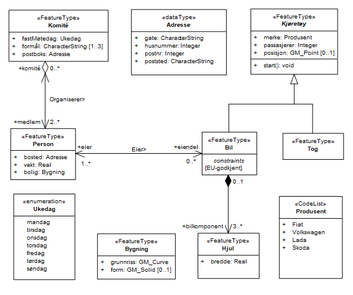

For å sikre at alle stereotyper og tagged values er i henhold til standardene bør SOSI-UML-profil 5.1 installeres og alltid benyttes når nye klasser skal lages. Eksisterende klasser med stereotype uten UML-profil eller fra eldre UML-profiler bør bytte til stereotype fra nyeste UML-profil. Ved bytte av UML-profiler må vi sikre at alle verdiene i tagged values videreføres.
Nye modellelementer kan lages ved bruk av en standard UML-profil og ved bruk av ulike skript for innlegging av tagged values.  Eksempel på innlegging av en helt ny egenskap som ikke finnes fra før til en eksisterende objekttype i fagområdet. Velg egenskaper, og velg "New Attribute", og fyll ut merkede felt for egenskapsnavn, datatype, synlighet og multiplisitet, legg inn definisjon, velg til slutt Close. 

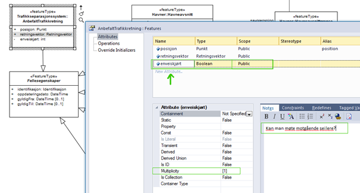

Enkle måter å lage helt nye elementer på er beskrevet i følgende seks trinn.
Velg nytt diagramverktøy av typen SOSI UML profil 5.1, du får da en ny verktøykasse tilgjengelig.

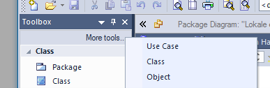

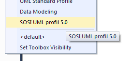

* Trinn 13.1 Ny applikasjonsskjemapakke med korrekt stereotype lages ved å velge verktøy fra verktøykassa under SOSI UML profil 5.1.

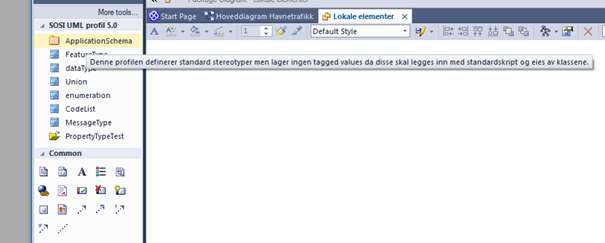

og klikke i et pakkediagram og skrive inn pakkenavnet.

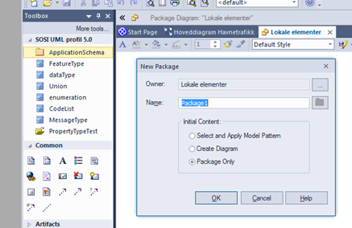

Alle modellelementer skal ha en forståelig definisjon, også applikasjonsskjemapakker. 

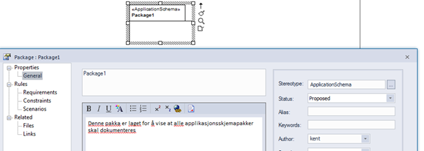

* Trinn 13.2 Lag nye objekttyper, datatyper og kodelister ved å dra fra verktøykassa inn i et diagram. Fyll så ut den nye elementenes navn og definisjon (i Notes-feltet). Ny objekttype lages ved å velge FeatureType fra verktøykassa under SOSI UML profil 5.1 og klikke i et diagram.

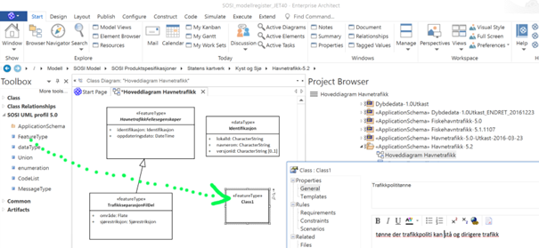

* Trinn 13.3 Lag nye egenskaper ved å velge objekttypen og klikke på Details/Attributes.

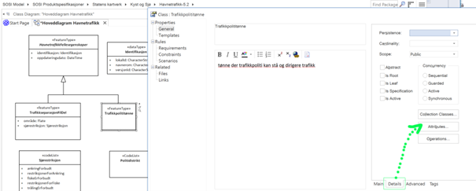

Legg inn egenskapens navn, datatype og at egenskapen er synlig (Public).  

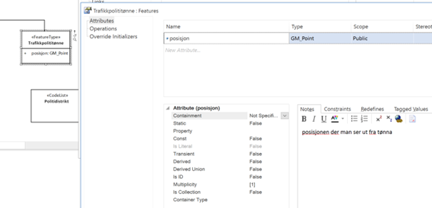

Skriv også inn den nye egenskapens definisjon i notefeltet, og sett ønsket multiplisitet.

* Trinn 13.4 Lag ny assosiasjon ved å velge fra Class Relationships i standard verktøykassa og dra denne fra en objekttype til en annen.

image::img/lage-helt-ny-assosiasjon.png[]

Dobbeltklikk på assosiasjonen, velg SourceRole eller TargetRole (der endeklassen er den korrekte) og og skriv inn den nye rollens navn og definisjon, sett navigerbarhetspil og velg multiplisitet. Trykk så på OK

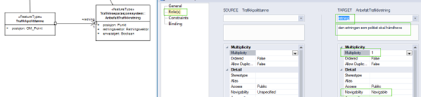

* Trinn 13.5 Lag nye kodelister ved å dra ifra verktøykassa SOSI UML profil 5.1. Skriv inn kodelistens navn og definisjon og trykk OK.

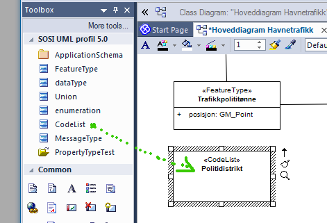

Trinn 13.6	Lag nye kodeverdier ved å klikke på kodelisteklassen og velge Details -> Attributes og skrive inn kodene. Husk at kodenes navn skal være NCName uten blanke og skilletegn. Typen skal være tom, <none> eller <undefined>. Alle koder skal ha forståelig definisjon. Trykk Close når ferdig.

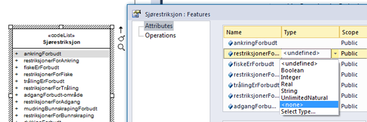

Dersom kodelista eksisterer som en eksternt forvaltet fil eller et eksternt forvaltet register kan man la være å legge inn koder og heller angi http-URI til fila eller registeret. Dette gjøres ved å legge inn en gyldig http-URI i en tagged value codeList, og legge inn verdien true i en tagged value asDictionary.

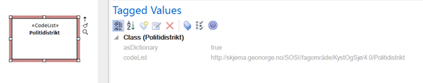

Egenskaper som bruker denne kodelista som datatype bør i tillegg ha den samme http-URI-en i en egen tagged value defaultCodeSpace. Da vil denne http-URI-en kunne komme med i GML-Applikasjonsskjema ved bruk av encodingregel sosi under generering.

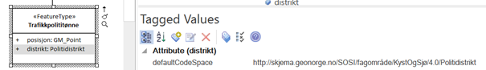

I noen modelleringsvertøy eies tagged values av stereotypen finnes), og når en endrer eller fjerner slike stereotyper så fjernes tilhørende tagged values og alle inntastede verdier blir borte! En må derfor huske å deaktivere slike verktøy (som "MDG teknologi for SOSI") før en fjerner eller endrer på stereotyper. 
Dette gjelder særlig produktspesifikasjoner der nye egenskaper, koder og roller er laget fra grunnen av med den gamle verktøykassa "SOSI" i "MDG for SOSI". 
Alle modellene som hentes fra SOSI fagområder har unngått dette problemet.

