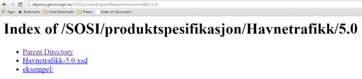

[discrete]
== Trinn 28 Legg inn GML applikasjonsskjema på angitt skjemalokalisering.	

//Trinn 28 versjon 2024-09-12

For publisering kan GML-applikasjonsskjemaet sendes til:
mailto:standardiseringssekretariatet@kartverket.no 
En versjon som er uferdig og åpen for videreutvikling kan legges på:
http://skjema.dev.geonorge.no/SOSI/produktspesifikasjon/ 
eller i en angitt periode for åpen test mot reelle datasett legges den på: 
http://skjema.test.geonorge.no/SOSI/produktspesifikasjon/ 
for å bli endelig publisert som gyldig og autoritativt GML-applikasjonsskjema på:
http://skjema.geonorge.no/SOSI/produktspesifikasjon/.

Skjemaplassering kan også benyttes til publisering av eksempeldata, disse skal da navnes og legges slik: http://skjema.geonorge.no/SOSI/produktspesifikasjon/Havnetrafikk/5.0/eksempel/Oslo.gml
Skjemaene kan brukes direkte til konfigurering av WFS-tjenester og til oppsett av PostGIS databaser og lignende.
Kvalitetssikring av GML-datasett og WFS-tjenester som følger produktets GML-applikasjonsskjema bør avtalefestes. Dette kan avtales med Kartverket ved å sende en epost til post@norgedigitalt.no merket WFS-tjeneste.
