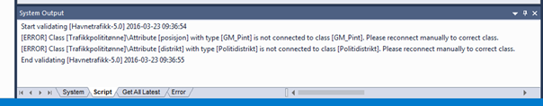
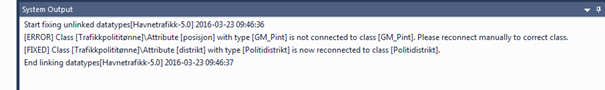

[discrete]
== Trinn 17 Re-etabler alle koblinger til korrekte datatyper og kjør validering.

//Trinn 17 versjon 2024-09-11

Sjekk at alle objekttyper og datatyper er kopiert inn i applikasjonsskjemapakka. 
Alle klasser som benyttes skal finnes i denne pakka, med unntak av basistyper:
(Integer, Real, Boolean, CharacterString, Date og DateTime, LanguageString, URI, Vector, Record,...) og geometrityper:  (Flate, Kurve, Punkt, Sverm samt alle lovlige iso-geometrityper som GM_Point, GM_Curve, GM_Surface, GM_Solid og GM_Multi- og GM_Composite- varianter, GM_Object,...).
Merk at UML-datatyper som int og string ikke er akseptable, og at "undefined" benyttes på kodelistekoder.
Kontroll av at alle egenskaper er oppkoblet kan utføres helautomatisk ved å høyreklikke på pakka og velge Scripts/listDatatyperUtenOppkobling.

Oppkobling til datatyper innenfor egen applikasjonsskjemapakke der egenskapens datatypenavn tilsvarer en egendefinert datatypeklasse innenfor pakka kan utføres helautomatisk ved å høyreklikke på pakka og velge Scripts/kobleOppDatatyperFraSammeApplikasjonsskjema og trykke Ok.

Egenskaper med opplagte skrivefeil i datatype må selvfølgelig rettes manuelt.
Objektegenskapenes datatyper skal kun peke til klasser i den samme pakka. 
Hvis man ser at det fortsatt pekes til nødvendige klasser i en annen pakke kan man først hente inn de manglende klassene, som beskrevet i punkt 6, og så gjenta dette punktet. 
Dersom produktspesifikasjonen har kopier av SOSI_Fellesegenskaper eller SOSI_Objekt kan det være ønskelig å fjerne alle kopier av realiseringsassosiasjonene som peker ut ifra disse klassene. 
Dette kan gjøres automatisk ved å velge klassen med fellesegenskaper i prosjektbrowseren og kjøre skript: Scripts/slettUtoverrettaRealiseringerFraKlasse
Når alle eksterne avhengigheter er løst opp skal man til slutt fjerne alle de innkopierte pakkene som inneholder restene av ubrukte fagområdeobjekttyper og lignende. 
Validering av om modellelementene er akseptable konseptuelt utføres automatisk ved å laste ned og kjøre Addin SOSI-Model-Validation
eller kjøre en gammel versjon ved å høyreklikke på applikasjonsskjemapakka i prosjektbrowseren og kjøre skript: Scripts/SOSI model validation.
