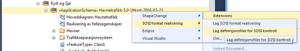
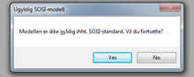
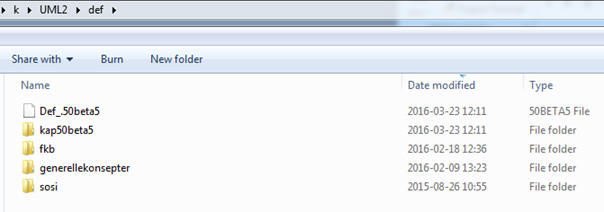

[discrete]
== Trinn 23 Generer SOSI-Kontrollfiler.

//Trinn 23 versjon 2024-09-12

Viktige tagged values som må være satt for applikasjonsskjemapakka er:
* Verdien av tagged value "SOSI_kortnavn" brukes bl.a. som filnavn ulike steder (eks Planomriss-48) og skal derfor ikke inneholde blanke eller skilletegn.
* Verdien av tagged value "SOSI_versjon" skal angi hviken hovedversjon formatrealiseringen bygger på (eks. 4.5 eller 5.0).
* Verdien av tagged value "SOSI_modellstatus" skal angi om modellen er komplett og godkjent (gyldig), eller ikke (utkast).
For SOSI-format versjon 5.0 kan man høyreklikke på applikasjonsskjemapakka og velge Scripts/listSOSIKontrollfiler. Skriptet spør deretter om bekreftelse på kortnavnet og viser meldinger i systemvinduet når den angitte katalogstrukturen er laget.
For generering av SOSI-format versjon 4.x kan man høyreklikke på applikasjonsskjemapakka og velge 
Extensions/SOSI/definisjonsfiler for SOSI-Kontroll.

Dersom en får denne meldingen om at modellen ikke er gyldig så trykk da ubekymret og ufortrødent på Yes for å fortsette. (Testen der er ikke korrekt.)

Det kan ha kommet andre inn meldinger i systemloggvinduet nederst. Disse kan indikere at modellvalideringen på slutten av punkt 17 bør kjøres pånytt.
Det vil komme opp en egen katalog der definisjonsfilene er lagret.

Innholdet i den genererte katalogen kan benyttes direkte i SOSI-Kontroll til å teste mot reelle SOSI-formaterte data.
Oppdages det feil på dette stadiet kan det eventuelt være nyttig å gå tilbake til modellen og forbedre og tilpasse denne til å beskrive de tilgjengelige datakilder. 
For å få produktet inn i distribusjon av det offisielle settet med SOSI-Kontrollfiler må en lagre den ferdige applikasjonsskjemapakka tilbake i SOSI modellregister, og melde ifra i epost til Kartverkets post@norgedigitalt.no merket SOSI-Kontroll om at datafiler skal kunne valideres mot dette produktets applikasjonsskjema. Filene vil da genereres og testes, og publiseres til alle brukere av SOSI-kontroll.

