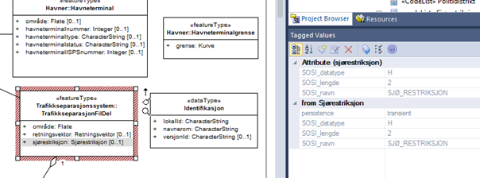

[discrete]
== Trinn 22 Kontroller at tagged values for alle SOSI_navn og SOSI_lengde er lagt inn.

//Trinn 22 versjon 2024-09-12

Skriptet Scripts/realiserbarSOSIformat50 går gjennom alle aktuelle modellelementer og sjekker at den finner alle påkrevde tagged values for realisering i SOSI-format versjon 5.0. Mange eldre fagområdestandarder har allerede slike tagged values for SOSI-format. Taggenes innhold må inspiseres og eventuelt korrigeres manuelt.

Manglende tagged values kan legges inn helautomatisk ved å høyreklikke på applikasjonsskjemapakka og velge Scripts/leggInnSOSIformat50Tagger og trykke Ok. Disse taggenes verdier må manuelt sjekkes og eventuelt rettes etterpå. Eksisterende tagged values blir ikke berørt.
Merk at fagområdemodellene kan inneholde mange flere, og til dels komplekse tagged values laget for eldre SOSI-format-støtte. Disse kan ignoreres. 

