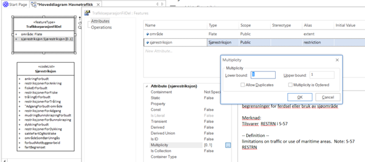
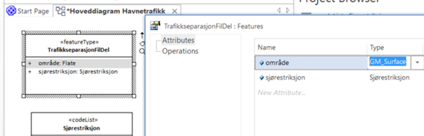

[discrete]
== Trinn 10 Stram eventuelt inn på multiplisitetskravene på de resterende egenskapene som alltid skal finnes og kunne være søkbare.

//Trinn 10 versjon 2024-09-09

I fagområdene er de fleste egenskapene opsjonelle, men i et produkt bør en bestemme seg for å kreve verdier på flest mulig av egenskapen for alle objekter, slik at en bruker kan søke på disse verdiene og stole på at de ikke mangler noen steder. Da skal multiplisiteten på egenskapen endres fra [0..1] til eksakt antall [1..1]. (Påkrevede egenskaper vises uten [1..1], påkrevde roller vises med 1 eller 1..*.) Utfyllende føringer for hvordan man kan stramme inn kan finnes på: kartverket.no/globalassets/standard/retningslinjer-og-veiledere/retningslinjer-forholdet-objektkatalog-og-produktspesifikasjoner_2.0.pdf

Geometrityper med navn Punkt, Kurve eller Flate kan gjerne spesifiseres mer presist ved å endre disse til spesifikke iso-geometrityper. De enkleste av disse er GM_Point, GM_Curve og GM_Surface.

