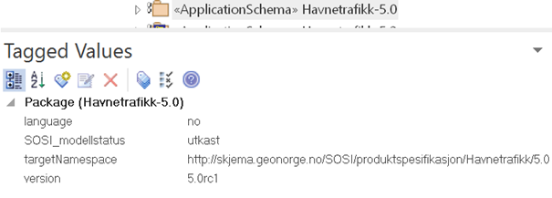

[discrete]
== Trinn 14 Legg inn plattformuavhengige tagged values. 

//Trinn 14 versjon 2024-09-11

Applikasjonsskjemapakka skal ha noen få tagged values som er felles for alle plattformer. Disse kan legges in manuelt med standard EA menyer. Under vises eksempel med manuelt utfylte verdier.

Når en velger realiseringsformat og kjører skript for automatisk realisering (SOSI-format eller GML-format) vil de plattformuavhengige tagged values som mangler også legges inn automatisk sammen med alle de plattformspesifikke tagged values. I så fall kan denne innleggingen gjerne utsettes til punktene 22. og 25.

