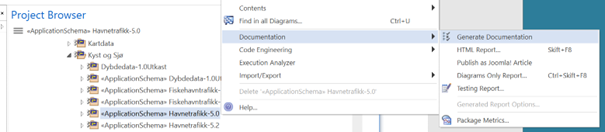

[discrete]
== Trinn 19 Generer tekstlig dokumentasjon via tilrettelagt rapportmal.

//Trinn 19 versjon 2024-09-12

Dokumentasjonsmalen er lagret i fila SOSI_modellregister_JET40.eap. Den kan også lastes ned fra kartverket.no. Beskrivelse av hvordan disse filene er laget ligger i installasjonsveiledningen.
Generer word-dokument ved å høyreklikke på applikasjonsskjemapakka i prosjektbrowseren og velge "Documentation -> Generate Documentation":

Velg fra lista Template: SOSI dokumentasjonsmal 2020 1.0 og 
Format: DOCX, og angi filnavn for resultat, trykk så Generate.

